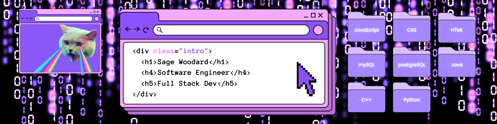

- Hi, I’m Sage. Let’s connect and collaborate!

- 👩‍💻 Experience: Software engineer with 3+ years of experience
- 🎓 Education: B.S. in Computer Science (2023)
- 👾 Interests: Full-stack and back-end web development
- ⚙️ Skills: Python, JavaScript, CSS, SQL, etc.
- 🔗 Portfolio: sageainsley.com | LinkedIn: https://www.linkedin.com/in/sagewoodard/

<!---
sagewoodard/sagewoodard is a ✨ special ✨ repository because its `README.md` (this file) appears on your GitHub profile.
You can click the Preview link to take a look at your changes.
--->
